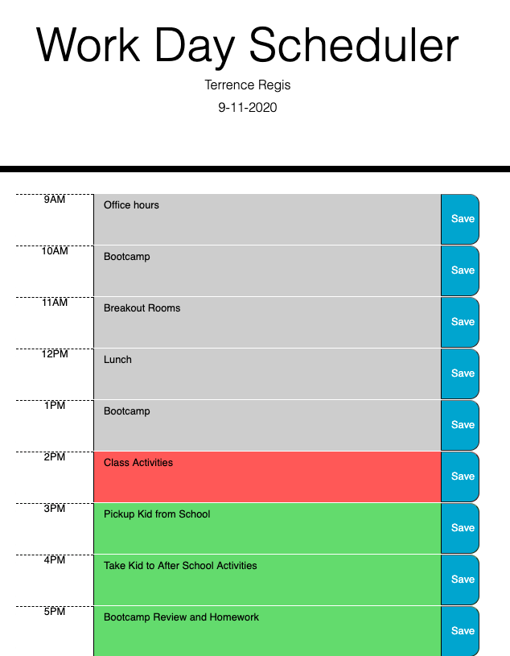

Project Name: # Work-Day-Scheduler
Desecription: This project created a calender to capture one day schedule.

Insallation: NA; access url: https://tregis-cloud.github.io/Work-Day-Scheduler/.

Usage: You can store your daily schedule on this day planner. It gives you the current date in the heading; and allows you nine one hour slots to create your appointments for the day. If an appointment is current, the background colors for that appointment will be be in red; if it's in the future, it will be green; and if it's in the pass, it will be gray.

Testing: 1) Enter an appointment in the calander, make sure it saves and persist on the screen. 2) Edit an existing schedule item, ensure it is persist. 3)Very if the current time is greater than a time slot, that time slot is gray; if the current time is less than the current timeslot, that timeslot is green and if the current time slot is equal to the current time (in hours only) that time slot should be red.
